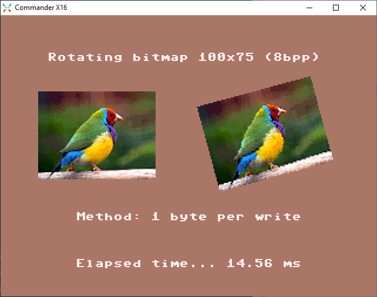

# VERA FX Tests

The VERA FX update contains quite a lot of new features that need to be tested.

Below are the FX tests that have been created to test all facets of the FX feature set.

### Running the tests

For each of these tests a PRG file is generated. These PRG files are located in the SD folder. 
Some tests require some additional files and these are also included in the SD folder.

To run the tests copy the contents of the SD folder (in this git repo) to a folder on your SD card (e.g. "FX").
Then using the `DOS "CD:<MY FOLDER>` command go to the folder you just copied and where all the tests are located. 
Pressing `F7` or using the command `DOS "$` (or the command `LOAD "$"` followed by `LIST`) you can see all the PRG files. 
Do a `LOAD "<THE FILENAME.PRG>"` to load a specific test program and `RUN` to execute it.

Alternatively you can use a .rom file (inside the ROM folder) to run these tests as a ROM.

# Features to test

In the following sections several test programs will be described and screenshots will be included for each run on a machine or emulator.

These test programs test something specific: either an **old or a new feature** of VERA. Basicly, if things are working, something has been proven to work on that machine or emulator.

What they actually tested is mentioned in the column *"What this tests"*. This column will contain test (result) codes.

These start with a specific letter to group them together. These are the test groups:

| Group | Meaning |
| ---- | ------- |
|   A  | Affine helper |
|   B  | Backwards compatibility |
|   C  | 32-bit Cache |
|   L  | Line draw helper |
|   O  | Other features |
|   P  | Polygon filler helper |

In the last section called *"Test results"* all test results (their code and their description) are put together in one table showing what does (or does not) work on what type of machine/emulator.

## Cache write tests

These tests use the 32-bit cache to **write a constant value** many times to a bitmap. Essentially filling the screen.

There are two variants: 
  - writing one byte a time (the old way) 
  - writing four bytes at the same time (using the 32-bit cache)

Here are the PRG names and what their results look like:

| PRG  | Screenshot Emulator | Screenshot HW | What this tests |
| ------------- | ------------- | ------------- | ------------- |
| `SINGLE-WRITE.PRG`  |  | | B1 |
| `MULTI-WRITE.PRG`  |  | | C1 C3 |

## Cache read and write tests

These tests use the 32-bit cache to **read and write** (aka copy) many times from and to VRAM. Essentially copying a bitmap to the screen.

There are two variants: 
  - reading and writing one byte a time (the old way) 
  - reading one and writing four bytes at the same time (using the 32-bit cache)

Here are the PRG names and what their results look like:

| PRG  | Screenshot Emulator | Screenshot HW | What this tests |
| ------------- | ------------- | ------------- | ------------- |
| `SINGLE-READWRITE.PRG`  |  | | B1 B2 |
| `MULTI-READWRITE.PRG`  |  | | C2 C3 |

## Line draw tests

These tests use the line draw helper mode to draw diagonal lines.

This is what both variants do: 
  - Set the start address somewhere in a bitmap (of the screen)
  - Set the increment (per Bresenham's algo)
  - Start writing bytes to ADDR1

These are the variants:
  - Drawing the old way (8bpp): without the use of the line draw helper
  - Drawing the new way (8bpp): with the use of the line draw helper
  - Drawing the new way (4bpp): with the use of the line draw helper

Here are the PRG names and what their results look like:

| PRG  | Screenshot Emulator | Screenshot HW | What this tests |
| ------------- | ------------- | ------------- | ------------- |
| `LINE_8BPP-NOFX.PRG`  |  | | ... |
| `LINE_8BPP-FX.PRG`  |  | | ... |
| `LINE_4BPP-FX.PRG`  |  | | ... |

## Affine helper tests

These tests use the affine helper mode to **rotate or shear** a bitmap. Any kind of affine transformation (like scaling and flipping) are actually possible this way.

This is what both variants do: 
  - Copying a tilemap and tiledata to VRAM, effectively containing the source image
  - Setting the initial X and Y cooridinate to a starting point in the (tiled) source image 
  - Setting the X/Y increment for step in the source miage
  - Drawing a line to the destination, by doing this for each pixel:
    - Read a source pixel (this automatically increments X and Y (in the source) to the next position)
    - Write a source pixel to the destination
  - Set the starting point the next line (for rotation this is slightly more work on the CPU side)
    
**TODO**: add 4bpp variant

Here are the PRG names and what their results look like:

| PRG  | Screenshot Emulator | Screenshot HW | What this tests |
| ------------- | ------------- | ------------- | ------------- |
| `AFF_SHEAR-CACHE.PRG`  |  | | A1 A2 A3 A4 A5.1 A6 A7 C2.1 C3 C5.1 |
| `AFF_SHEAR-NOCACHE.PRG`  |  | | A1 A2 A3 A4 A5.1 A6 A7 B1 B2 O1.1 |
| `AFF_ROTATION-CACHE.PRG`  |  | | A1 A2 A3 A4 A5.1 A6 A7 C2.1 C3 C5.1 |
| `AFF_ROTATION-NOCACHE.PRG`  |  | | A1 A2 A3 A4 A5.1 A6 A7 B1 B2 O1.1 |

## Polygon filler tests

These tests use the polygon filler mode to **draw many polygons** to a bitmap. Essentially filling a rectangle with triangles.

There are two variants: 
  - Doing all the work on the CPU side (the old way) 
    - Calculating the X1 and X2 coordinates for each line
    - Setting the VRAM addresses each line
  - Using as many FX features as possible (8bpp)
    - Using the 32-bit cache to write multiple pixels at once
    - Using nibble masking when writing the cache to VRAM (not all pixels will be written)
    - Using the polygon filler helper to setup the ADDR1 each line
    - Using the polygon filler fill-length codes as input to JUMP-tables (65C02 feature)
    
**TODO**: add 4bpp variants
**TODO**: add 2bpp variant + dithering

Here are the PRG names and what their results look like:

| PRG  | Screenshot Emulator | Screenshot HW | What this tests |
| ------------- | ------------- | ------------- | ------------- |
| `POLYFILL-NOFXPOLY.PRG`  |  | | B1 B3 |
| `POLYFILL-FXPOLY-SLP-JMP.PRG`  |  | | C1 C3 C4 P1 P2 P3.1 P4.1 P5 |

## Multiplier and accumulator tests

## Tiled Perspective (integrated) tests 

## Polygon 3D Engine (integrated) tests

# Test results

Below is a complete list of the results of all the tests performed:

| Code | Description | Result Emulator | Result HW |
| ---- | ----------- | --------------- | --------- |
|  A1  | Setting the FX tilemap base address works | 

 |  |
|  A2  | Setting the FX tiledata base address works | 

 |  |
|  A3  | Setting the X/Y coordinate in a tilemap works | 

 |  |
|  A4  | Setting the X/Y increment for a tilemap works | 

 |  |
|  A5.1  | Reading bytes from the FX tilemap works (8bpp) | 

 |  |
|  A6  | Incrementing the X/Y coordinate after a read works | 

 |  |
|  A7  | Clipping a tilemap works (pixels form tile 0 are read) | 

 |  |
|  B1  | Writing to VRAM 1 byte at the time still works | 

 |  |
|  B2  | Reading from VRAM 1 byte at the time still works | 

 |  |
|  B3  | Setting of VRAM addresses still works | 

 |  |
|  C1  | Filling the 32-bit cache directly works | 

 |  |
|  C2.1  | Filling the 32-bit cache (1 byte at the time: 8bpp) by reading from VRAM works | 

 |  |
|  C3  | Writing the full 32-bit cache to VRAM works | 

 |  |
|  C4  | Writing the nibble-masked 32-bit cache to VRAM works | 

 |  |
|  C5.1  | Transparent writes work with 32-bit cache (8bpp) | 

 |  |
|  O1.1  | Transparent writes work (8bpp) | 

 |  |
|  P1  | Polygon filler incrementers (X1 and X2) work | 

 |  |
|  P2  | Polygon filler (sub)pixel positions (X1 and X2) work | 

 |  |
|  P3.1  | Polygon filler setting ADDR1 = ADDR0 + X1 works (8bpp) | 

 |  |
|  P4.1  | Polygon filler reading fill length code works (8bpp) | 

 |  |
|  P5  | Polygon filler reset of (sub)pixel positions (X1 and X2) works | 

 |  |

